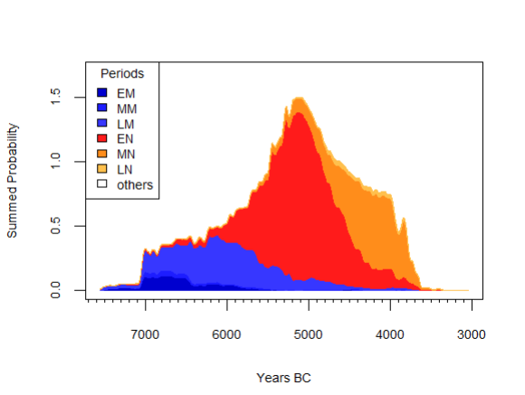

# ***NeoNet***

NeoNet is a framework for working on the Late Mesolithic/Early Neolithic transition. It is composed of the [NeoNet interactive app](https://github.com/zoometh/neonet#neonet-app--mapping-the-late-mesolithicearly-neolithic-transition-) and the [R package NeoNet](https://github.com/zoometh/neonet#neonet-package)

---

Further explanations can be found in the [web document](https://zoometh.github.io/neonet/). If you want to contribute to the development version of the app, or the dataset, check the [contribution rules](https://github.com/zoometh/neonet/blob/master/github/CONTRIBUTING.md) and the [relevant license](https://github.com/zoometh/neonet/blob/master/LICENSE)

## ***NeoNet*** app <br> <sub><sup>mapping the Late Mesolithic/Early Neolithic transition </sup></sub>
> <sub>[Thomas Huet](mailto:thomas.huet@arch.ox.ac.uk), [Niccolò Mazzucco](mailto:niccolo.mazzucco@unipi.it), [Miriam Cubas Morera](mailto:mcubas.morera@gmail.com), [Juan Gibaja](mailto:jfgibaja@gmail.com), [F. Xavier Oms](mailto:oms@ub.edu), [António Faustino Carvalho](mailto:a.faustino.carvalho@gmail.com), [Ana Catarina Basilio](mailto:catarinasbasilio@gmail.com), [Elías López-Romero](elias.lopez-romero@iam.csic.es)</sub>

The ***NeoNet app*** is an R Shiny application for mapping radiocarbon (C14) dates from the Late Mesolithic/Early Neolithic transition in the North-Central Mediterranean and European South Atlantic river basin. The application offers a mobile geographic window for date selection by location, various filters on chronology and date quality, a calibration window, and other tools to create a user-friendly interface supported by a curated dataset of radiocarbon dates and archaeological contexts. 

### *NeoNet Mediterranean* stable version

The region of interest (ROI) is the <a href="https://github.com/zoometh/neonet/blob/main/doc/data/wsh_med.geojson" target="_blank">north-central Mediterranean river basin</a>. The NeoNet app **stable version** is hosted on the server of the University of Pisa: <a href="http://shinyserver.cfs.unipi.it:3838/C14/" target="_blank">http://shinyserver.cfs.unipi.it:3838/C14/</a>. This NeoNet app uses this radiocarbon dataset: <a href="https://doi.org/10.13131/archelogicadata-yb11-yb66" target="_blank">https://doi.org/10.13131/archelogicadata-yb11-yb66</a> (Please refer to this dataset using [this reference](https://github.com/zoometh/neonet#citation))
 
#### Overview

The region of interest (ROI) is the North-Western Mediterranean river basin.


  
The time span from is focused on the Late Mesolithic/Early Neolithic transition, i.e. the last hunter-gatherers (HG) and the first farmers (EF).  Conventional period colors are listed [here](https://github.com/zoometh/neonet/blob/main/inst/extdata/periods.tsv).
  
The NeoNet web app allows you to select radiocarbon dates on the map and calibrate them on the fly. Each date can be displayed separately or grouped with other dates by layers, sites and periods. Dates are presented ordered on their summed probability densities (SPDs) averages. These graphs can be downloaded. 


  
#### Citation

The NeoNet Mediteranean dataset has been published in the [Journal of Open Archaeology Data](https://openarchaeologydata.metajnl.com/) under this BibTex reference:

```
@article{Huet22,
  author = {Huet, Thomas and Cubas, Miriam and Gibaja, Juan .F. and Oms, F. Xavier and Mazzucco, Niccolo},
  title = {NeoNet Dataset. Radiocarbon Dates for the Late Mesolithic/Early Neolithic Transition in the North Central-Western Mediterranean Basin},
  journal = {Journal of Open Archaeology Data},
  year = {2022},
  volume = {10},
  number = {3},
  pages = {1-8},
  doi={10.5334/joad.87},
}
```
### *NeoNet Atlantic* development version

The region of interest (ROI) is the <a href="hhttps://github.com/zoometh/neonet/blob/main/doc/data/wsh_atl.geojson" target="_blank">European South Atlantic river basin</a>. New functionalities will be added to the app (download button for the selected dataset, possibility to set *tpq* and *taq* limits for the SPDs, etc.)
  
## ***NeoNet*** package <br> <sub><sup>radiocarbon management </sup></sub>
> <sub>[Thomas Huet](mailto:thomas.huet@arch.ox.ac.uk)</sub>

The R package is under development, with:
 
* R functions: [R/](https://github.com/zoometh/neonet/tree/main/R) folder

* Dates: [140_140_id00140_doc_elencoc14.tsv](https://github.com/zoometh/neonet/blob/main/inst/extdata/140_140_id00140_doc_elencoc14.tsv) folder

* Material life duration mapping table: [140_id00140_doc_thesaurus.tsv](https://github.com/zoometh/neonet/blob/main/inst/extdata/140_id00140_doc_thesaurus.tsv)

* BibTex references: [id00140_doc_reference.bib](https://github.com/zoometh/neonet/blob/main/inst/extdata/id00140_doc_reference.bib)


### Data preparation

Running these `neo_*()` functions on a new dataset.

Sourcing functions

```R
source("R/neo_subset.R")
source("R/neo_bib.R")
source("R/neo_matlife.R")
source("R/neo_calib.R")
source("R/neo_merge.R")
source("R/neo_html.R")
source("R/neo_datamiss.R")
source("R/neo_datasum.R")
source("R/neo_doi.R")
```

Read the dataset

```R
data.c14 <- paste0(getwd(), "/inst/extdata/", "NeoNet_atl_ELR (1).xlsx")
df.bib <- paste0(getwd(), "/inst/extdata/", "NeoNet_atl_ELR.bib")
```

Cleaning the dataset and making it conform to the NeoNet published dataset

```R
df.c14 <- openxlsx::read.xlsx(data.c14)
df.c14 <- neo_subset(df.c14,
                     rm.C14Age = TRUE,
                     rm.Spatial = FALSE,
                     rm.Period = FALSE)
df.c14 <- neo_calib(df.c14)
neo_doi(df.c14)
```

Calculating basic statistics: missing data

```R
neo_datamiss(df.c14)
```

### Merging the dataset with the NeoNet Med one

Prepare the dataset for the Shiny application by merging it with NeoNet Med, calculating materil life duration, and HTML popup layouts

```R
df.c14 <- neo_merge(df.c14 = df.c14, 
                    data.bib = data.bib, 
                    merge.bib = F)
df.c14 <- neo_matlife(df.c14)
df.c14 <- neo_html(df.c14)
```

Export the merged dataset

```R
write.table(df.c14, "C:/Rprojects/neonet/R/app-dev/c14_dataset_med_x_atl.tsv",
            sep = "\t",
            row.names = FALSE)
```

### Create a SPD plot

Plot the SPD of the two datasets, once `df.c14` calculated

```R
library(rcarbon)

source("R/neo_spd.R")
source("R/neo_spdplot.R")

neo_spd(df.c14 = df.c14)
```




The `neo_spd()` calls the `neo_spdplo()` adapted from `rcarbon::plot.stackCalSPD.R` to fetch the conventional periods colors


### Calculate isochrones

Create a map with isochrone contour to model the spread of Neolithic

```R
library(rcarbon)

source("R/neo_isochr.R")
source("R/neo_spd.R")

neo_isochr(df.c14 = "C:/Rprojects/neonet/results/2023-09-15_neonet.geojson")
```
  
The file [2023-09-15_neonet.geojson](https://github.com/zoometh/neonet/blob/main/results/2023-09-15_neonet.geojson) is an export from the NeoNet app (see "export dates" in the [web document](https://zoometh.github.io/neonet/#export_dates))

The output is a map with isochrones calculated on the median of calibrated Early Neolithic (EN) dates


