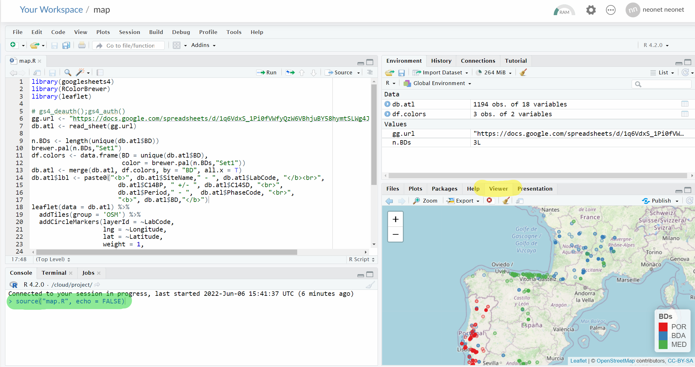

## Resources

### NeoNet atlantic

* dataset:
https://docs.google.com/spreadsheets/d/1q6VdxS_1Pi0fVWfyQzW6VBhjuBY58hymtSLWg4JyLEA/edit?usp=sharing&urp=gmail_link

* bibliographical references:
https://drive.google.com/file/d/1etzPAp8dL7HFpkMKlATbw3BvauxbaBWE/view?usp=sharing

* thesaurus:
https://docs.google.com/spreadsheets/d/1cTj7c6W2anZ7-j2isivZ0xW4SlO3TB4fexwXRvaRSQ0/edit?usp=sharing

### Interactive map

After editing the Google Sheet, see the results on a map

1. Log In https://rstudio.cloud/

    - *Email*: neonet.radiocarbon@gmail.com
    - *Password*: neonet-radi0c@rbon

2. Open the project **map**


3. In the console window (down-left, in <span style="color:green"><b>green</b></span>), run: 
```
source("map.R", echo = FALSE)
```   

4. To see the computed map, select the **Viewer** panel in the graphical output window (down-right, in <span style="color:yellow"><b>yellow</b></span>)



5. Enlarge the map size clicking on Zoom (🔎) below the **Viewer** panel

### Other ressources

* GitHub of the app:
https://github.com/zoometh/neonet

* Tutorial of the app & dataset:
https://zoometh.github.io/neonet/

* App:
http://shinyserver.cfs.unipi.it:3838/C14/

* JOAD article:
https://openarchaeologydata.metajnl.com/articles/10.5334/joad.87/

## Tasks (proposal)

* Niccolo:
    - Overall standardization
    - Relation with the IT service of the University of Pisa

* Thomas: 
    - Standardization of the Atlantic dataset
    - App & GitHub & tutorial maintenance
    - FAIRisation (`get_neonet()` function)

* Gregor:
    - France dataset & bibliographical references

* Miriam & Gibi & FX:
    - Spain dataset & bibliographical references

* Antonio & Ana:
    - Portugal dataset & bibliographical references